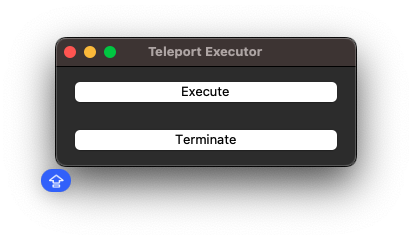

# Teleport - 자동화 툴 
> Midasin의 개발환경에서 DV, ST, QA Database 접근을 위한 명령어 자동화 프로젝트

## 1. 사용 방법
1. pyton 및 모듈 다운로드&설치
    - python
    - pyotp
    - window 일 경우
        - wexpect
    - linux or macOS 일 경우
        - pexpect
    ```zsh
    pip install {module name} # 혹은 pip3 install {module name}
    ```
2. 다음 양식에 맞춰 설정 정보 설정
    ```python
    {
        "OTP_SECRET_KEY": "your_secret_key",
        "USER_ID": "your_id",
        "USER_PW": "your_password",
        "DV_PORT": "4306",
        "ST_PORT": "4307",
        "QA_PORT": "4308"
    }
    ```
   - 참고: OTP Secret Key는 Google OTP를 통해 생성된 키값을 입력하는 것이며 찾지 못하겠다면 다음 방법을 참고하자
     1. Teleport - QR 코드를 핸드폰 등으로 읽어 URL cncnf
     2. URL을 통해 Secret Key를 찾아서 입력 (하단과 같은 url에서 your_secret_key 부분의 값을 가져오면 된다.)
        ```text
        otpauth://totp/midas-teleport%3Alhs0610%40teleport.devops.midasin.com?secret= {your_secret_key}
        ```
3. teleport_properties.py에 설정정보 경로 입력
    ```
    properties_path = {path}
    ```
3. 실행
   - windows OS -> teleport_ui.bat 실행 / macOS -> teleport_ui_sh 실행
   - 버튼을 통해 제어<p></p>
4. 기존 Database 접속 GUI 툴의 설정 변경
   - HOST는 localhost로 변경한다. 
   - port는 teleport-properties.py 입력한 dv, st, qa에 맞게 변경한다.
   - user는 developer 로 입력한다.
   - password는 공백으로 설정한다.

## 2. 차후 고도화 예정 사항
- GUI 사용 환경 개발 [1차 완료]

## 3. DevOps 팀 Teleport 참고 가이드 문서
- [Teleport 가이드 문서](https://midastech.atlassian.net/wiki/spaces/platform/pages/111869954/Teleport)

## 제작자
- ATS 개발팀: 이한솔


## Version Log
- 2024.10.23: 0.0.1
    - 최초 개발
- 2024.10.23: 0.0.2 
    - window 환경 고려 분기 로직 추가
- 2024.10.23: 0.0.3
    - windows OS / macOS GUI 추가